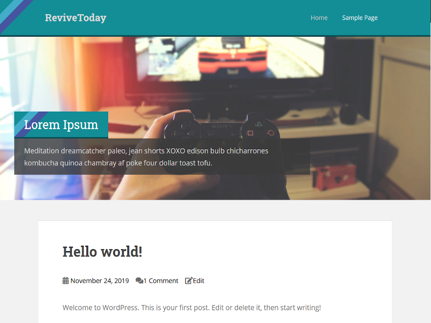

# Sparkling for ReviveToday
Small modifications to the [sparkling][source] theme for the [ReviveToday][site] website.

These modifications are largely bespoke, so we fully recommend you check out the original [ColorLib version][source].

⚠ **This theme has been deprecated. [Please see Modoki](https://github.com/ReviveToday/Modoki) for the latest ReviveToday theme.**

## Slider
The slider has been modified to use a Custom Post Type instead of a post category. This allows the slider to contain custom content and
links not found in the blog.

* Featured image is what will be displayed in the background.
* The WordPress body text will be displayed in the bottom left, including the title.
* `rt_url` is a valid meta entry, which will resolve as a URL in the slider.

## Shareblocks
Simple, toggleable buttons that mimic what the Jetpack share buttons would do, but with minimalistic functionality.

## Dark Mode
Add a menu item with the class name `rt-toggle-bright`, and it will function as a dark mode toggle.

## Advanced Ads Container
`above-title` custom placement is supported, which will display the advert above the title, as per the Acceptable Ads guidelines.

[site]: https://revive.today
[source]: https://github.com/ColorlibHQ/Sparkling
